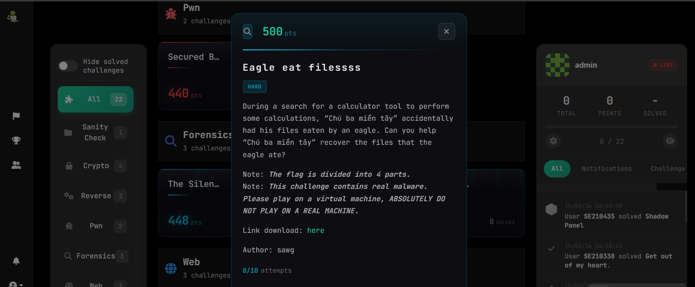
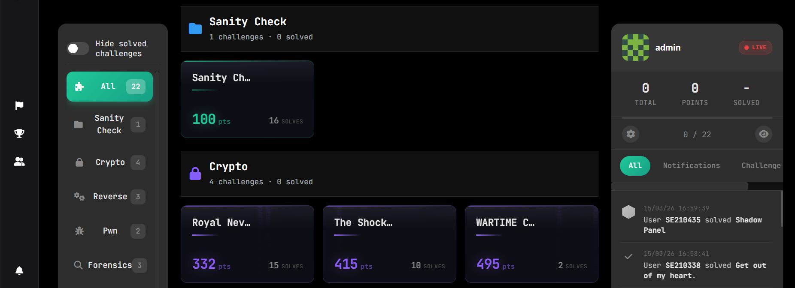
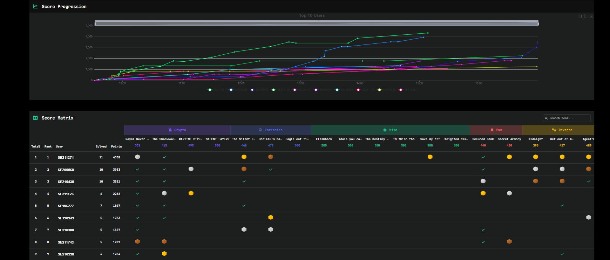
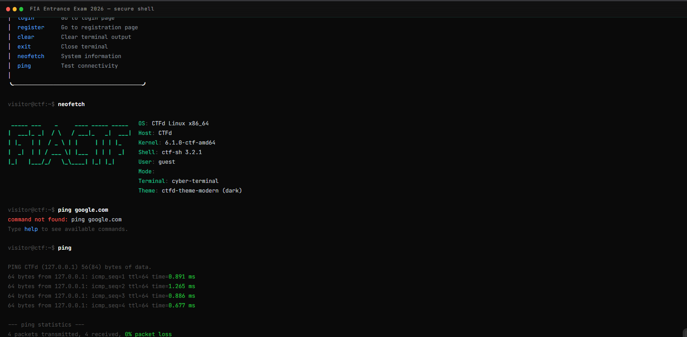

# ctfd-theme-modern

Developer-focused modern CTFd theme built with Bootstrap 5, Alpine.js, and Vite.

This theme is inspired by [ctfd-wmctf2025-theme](https://github.com/wm-team/ctfd-wmctf2025-theme/)

The goal of this repository is to keep page structure in Jinja templates while moving runtime behavior into `assets/js` (and styles into `assets/scss`) so builds remain fast and changes are easier to reason about.

## Screenshots










## What's in this theme

- Page runtime bundles (Vite inputs): `challenges`, `scoreboard`, `notifications`, `teams_*`, `users_*`, plus shared bootstraps like `base_bootstrap` and `theme_preload`
- Alpine.js components for interactive page state (for example `ChallengesPage`, `ScoreboardList`, and related runtime components)
- ECharts integration for the scoreboard graphs
- SCSS styling with a shared runtime stylesheet: `assets/scss/template_runtime_styles.scss`
- Fonts and icons:
  - JetBrains Mono (loaded from Google Fonts in `templates/base.html`)
  - Font Awesome (webfonts copied by Vite)

## Technical Stack

### Frontend
- Bootstrap 5
- Alpine.js (used for component state and Alpine `data` bindings)
- Vite (build + hashed assets + `static/manifest.json`)
- Sass/SCSS (theme styling)
- ECharts (scoreboard visualization)

### Fonts and Icons
- JetBrains Mono
- Font Awesome

### Build Pipeline
- Vite bundling and manifest output
- SCSS compilation
- Static asset copy pipeline

## Responsive Design

### Breakpoints
- Mobile-first behavior
- Tablet optimized layout
- Desktop full-featured experience

### Mobile Optimizations
- Touch-friendly controls
- Responsive cards and tables
- Collapsible navigation behavior

## Runtime integration (CTFd <-> frontend)

- `templates/base.html` renders a JSON config payload inside `<template id="ctfd-init-data">`.
- `assets/js/base_bootstrap.js` reads `ctfd-init-data` and exposes it as `window.init`.
- `ctfd-init-data` includes: `urlRoot`, `csrfNonce`, `userMode`, `userId`, `userName`, `teamId`, `teamName`, `start`, `end`, `themeSettings`, and `eventSounds`.
- Page templates include the correct Vite bundles via `{{ Assets.js("...") }}` and `{{ Assets.css("...") }}` (resolved through `static/manifest.json`).

If a page is "stuck loading", check the browser console for JS errors and confirm the correct entry bundle is included for that route.

## Installation and Development

### Prerequisites
- Node.js 16+
- npm (recommended for this repository)
- A CTFd instance for runtime testing

### Development Setup

1. Install dependencies:
   ```bash
   npm install
   ```

2. Development watch build:
   ```bash
   npm run dev
   ```

3. Production build:
   ```bash
   npm run build
   ```

### File Structure

```text
assets/
├── img/              # Images and branding assets
├── js/               # JavaScript modules
│   ├── components/   # Shared components
│   ├── template_runtime/
│   └── utils/
├── scss/             # Sass stylesheets
│   ├── includes/
│   └── main.scss
templates/            # Jinja2 templates
static/               # Compiled assets (generated)
```

### How to Use
1. Copy this theme into your CTFd installation under `CTFd/themes/ctfd-theme-modern`.
2. Run asset build inside the theme folder:
   ```bash
   npm install
   npm run build
   ```
3. Select the theme in CTFd (Admin settings) and restart CTFd if needed.

## Customization


### Dark Mode
- Supports dark and light themes
- Automatic preference-aware switching
- Consistent component-level theming

## Performance

### Optimization
- Optimized production assets via Vite
- Minified JS/CSS output
- Efficient font and image loading strategy

### Browser Support
- Chrome, Firefox, Safari, Edge (modern versions)
- Progressive enhancement for older environments

## License

This project is licensed under Apache License 2.0. See [LICENSE](LICENSE) for details.

